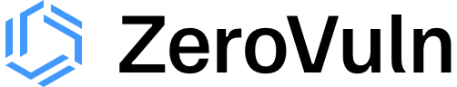

<!-- PROJECT LOGO -->
 

  

  <h3 align="center">ZeroVuln Infrastructure MonoRepo</h3>

<!-- TABLE OF CONTENTS -->

  
Table of Contents

  <ol>
    <li>
      <a href="#infra-product-core">ZV Infra Product Core</a>
    </li>
    <li>
      <a href="#infa-product-customer-endpoint">ZV Infra Product Customer Endpoint</a>
    </li>
    <ul><li><a href="#macos">MacOS</a></li></ul>
    <ul><li><a href="#k8s">K8s</a></li></ul>
    <li>
      <a href="#infa-product-customer-cloud">ZV Infra Product Customer Cloud</a>
    </li>
  </ol>

<!-- ZV INFRA PRODUCT CORE REPO-->
## ZV Infra Product Core Repo

This is the core infrastructure supporting the ZV product.

Built using the following:
1. [AWS-Serverless]

(<a href="#readme-top">back to top</a>)

<!-- ZV INFRA PRODUCT CUSTOMER ENDPOINT -->
## ZV Infra Product Customer Endpoint

This is the code supporting the ZV product customer endpoint.

<!-- MACOS -->
### MacOS

This is the GoLang code supporting MacOS package and chrome extension enumeration.

<!-- K8S -->
### K8s

This is the GoLang code supporting package enumeration in K8s via means of a DaemonSet. 

(<a href="#readme-top">back to top</a>)

<!-- ZV INFRA PRODUCT CUSTOMER CLOUD -->
## ZV Infra Product Customer Cloud

This is the code supporting the ZV product customer cloud.

(<a href="#readme-top">back to top</a>)

